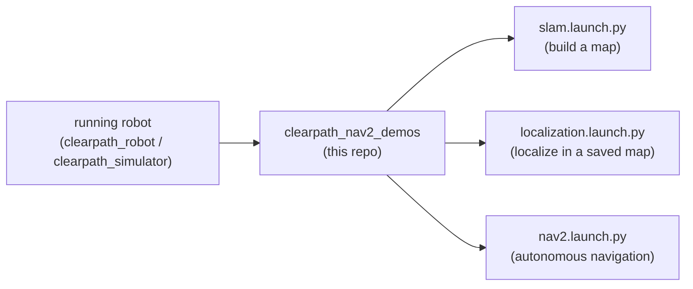

# clearpath_nav2_demos

Nav2 and slam_toolbox demos for clearpath platforms

Example [Nav2](https://docs.nav2.org/) and [slam_toolbox](https://github.com/SteveMacenski/slam_toolbox)
configurations and launch files showing how to run mapping, localization, and autonomous
navigation on Clearpath platforms.

For supported platforms, sensors, and manipulators plus additional details, please see:
<https://docs.clearpathrobotics.com/docs/ros/>

## Where this fits in the Clearpath ROS 2 stack

This is a **downstream demo** package. It assumes a robot is already running — either real
hardware (`clearpath_robot`) or simulation (`clearpath_simulator`) — publishing the standard
sensor topics and TF tree. It layers a navigation stack on top of that running robot.



## Layout

| Path | Description |
| --- | --- |
| [`launch/slam.launch.py`](launch/slam.launch.py) | Online SLAM with `slam_toolbox` to build a new map. |
| [`launch/localization.launch.py`](launch/localization.launch.py) | AMCL localization within an existing map. |
| [`launch/nav2.launch.py`](launch/nav2.launch.py) | The Nav2 navigation stack (planner, controller, behaviors). |
| [`config/`](config) | Per-platform parameter files (`a200`, `a300`, `dd100`, `dd150`, `do100`, `do150`, `j100`, `r100`, `w200`). |
| [`maps/`](maps) | Sample maps (e.g. `warehouse.pgm` / `warehouse.yaml`) matching the simulator worlds. |

## Usage

Start a robot or simulation first, then launch the desired demo. Parameters are selected per
platform via the `config/<platform>` directories. For example, to build a map:

```bash
ros2 launch clearpath_nav2_demos slam.launch.py
```

Then, to navigate within a saved map:

```bash
ros2 launch clearpath_nav2_demos localization.launch.py
ros2 launch clearpath_nav2_demos nav2.launch.py
```

See the [Clearpath navigation demos documentation](https://docs.clearpathrobotics.com/docs/ros/tutorials/navigation_demos/overview)
for the full, platform-specific walkthrough.

## Build

```bash
rosdep install --from-paths src --ignore-src -r -y
colcon build --symlink-install
source install/setup.bash
```

## Notes

- The demos do **not** start a robot; launch `clearpath_robot` or `clearpath_simulator` first.
- Pick the config that matches your platform. Mismatched footprints/sensor frames are a common
  cause of poor navigation behavior.
